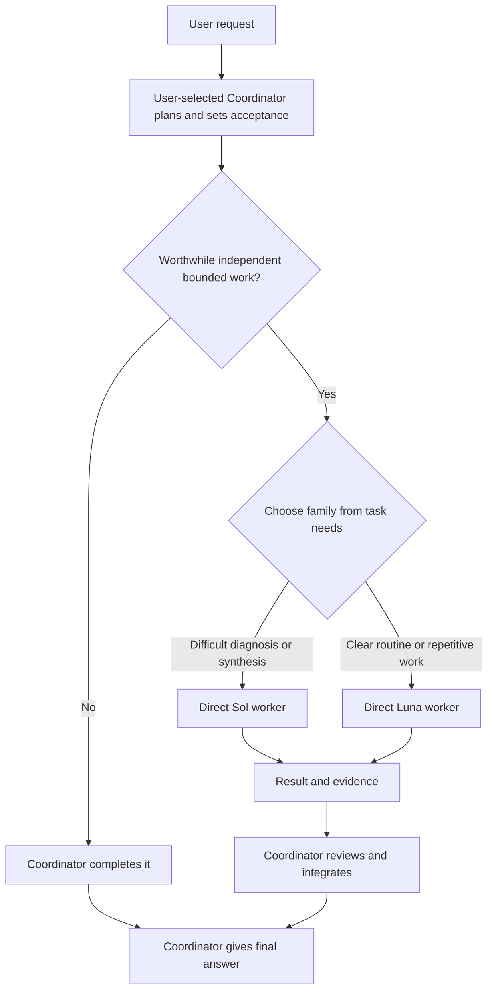

# Codex Native Workers

This branch is the **v4.3.0 acceptance candidate**, not yet published. The current published Stable remains [v4.2.0](https://github.com/SuperDaddyV/codex-native-workers/releases/tag/v4.2.0). The v4.3.0 installation prompt below becomes executable only after its Stable Release is published.

Keep the Coordinator you choose in charge while native GPT-6 Sol and Luna workers execute worthwhile, bounded tasks.

[简体中文](README.zh-CN.md)

[](https://github.com/SuperDaddyV/codex-native-workers/releases/tag/v4.3.0)
[](https://github.com/SuperDaddyV/codex-native-workers/releases/tag/v4.2.0-rc1)
[](https://github.com/SuperDaddyV/codex-native-workers/actions/workflows/validate.yml)
[](LICENSE)

> [!IMPORTANT]
> This is an independent community project. It is not affiliated with, sponsored by, or endorsed by OpenAI or ModelDial.

## What it is

Codex Native Workers v4.3 separates the user-selected **Coordinator** from two direct native worker families:

- **The Coordinator owns the task.** It keeps requirements, scope, architecture, ambiguity resolution, routing, integration, final acceptance, and the final answer. Astra is one Coordinator example; the package does not select or install the Coordinator model.
- **Sol handles difficult bounded execution.** Use it for diagnosis, synthesis, cross-module reasoning, and other complex work with a clear boundary.
- **Luna handles clear bounded execution.** Use it for well-specified implementation, extraction, targeted inspection, tests, builds, and repetitive work.

The project is **Codex Native Workers**, hosted at **`SuperDaddyV/codex-native-workers`**. Previous `codex-sol-luna-worker` links redirect to this repository. Installed paths, managed markers and the three `sol-luna-*` Skill names stay compatible, so the rename does not require moving your installation.

This is a configuration and routing package for local Codex clients. It does not include model access, credits, or a separate agent engine. Installation is user-wide; project-specific instructions and the client's actual capabilities still apply.

## Choose your version

| Version | Status | What it installs |
| --- | --- | --- |
| **v4.3.0** | **Acceptance candidate / unpublished** | Five Sol and five Luna worker profiles, three Skills; keeps your Coordinator choice. |
| v4.2.0-rc1 | Previous preview | The preceding two-family preview; existing users can upgrade to v4.3.0. |
| v4.1.4 | Previous legacy Stable | Sol planner + five Luna workers; no Sol worker profiles or three-Skill workflow. |

After publication, new and existing users can use the single **v4.3.0** prompt below. Until then, use the published [v4.2.0 instructions](https://github.com/SuperDaddyV/codex-native-workers/blob/v4.2.0/README.md). GitHub's **Latest** release is the Stable target. [Installation help and troubleshooting](INSTALLATION.md) covers prerequisites, verification and recovery.

## Stable installation (default)

Target: [Codex Native Workers v4.3.0](https://github.com/SuperDaddyV/codex-native-workers/releases/tag/v4.3.0). Start a local Codex task with shell access and paste this complete prompt. The task must verify that the Stable Release exists before installing anything.

```text
Install or upgrade to Codex Native Workers v4.3.0 Stable from
https://github.com/SuperDaddyV/codex-native-workers

Read https://api.github.com/repos/SuperDaddyV/codex-native-workers/releases/tags/v4.3.0.
Require a published, non-draft, non-prerelease Release. Resolve its remote tag
to one exact 40-hex commit, acquire a clean detached checkout, then read the
remote tag again; stop if it moved. Read NATIVE_WORKERS_SETUP.md from that
exact commit and follow it. Never install from master, target_commitish,
a moving branch, an unverified tag, or the old v4.1.4 setup contract.

Diagnose prerequisites together in this task's actual environment: codex, Git,
native custom agents, model access, HTTPS and both actual installation roots.
Before managed writes, require this actual command to pass:
python -c "import sys, tomllib; assert sys.version_info >= (3, 11); print(sys.version)"
Installed selectors use literal python; python3 or py alone is insufficient.
Preserve my Coordinator settings, existing roots and unrelated user content.
Run dry-run, inspect its paths, then apply only through the transactional
installer with the verified source commit and explicit CODEX_HOME/Skill roots.
Stop on ownership or integrity conflicts; do not overwrite or downgrade.
An already matching installation must have zero writes and zero new backups.
Request approval only for any system-level repair not already authorized.

Report installed identity, backup location, blockers and the exact next step.
Follow the installed read-only status Skill once. Reload if roles are not loaded,
then use the installed delegation Skill once for useful bounded Sol/Luna checks.
Report configuration and native results separately; do not call configuration
readiness full runtime acceptance. Keep the documented host-isolation limits.
```

The [Stable installation contract](NATIVE_WORKERS_SETUP.md) explains the workflow. Its executable authority is the copy in the verified release commit, not a moving branch. A source archive is not a one-click installer; do not manually copy managed files. A web-only chat cannot perform local installation.

Strong recursive isolation is unsupported. Workers request `[agents] enabled = false` and are instructed not to delegate, but these are not verified host enforcement. The rc1 host record on Desktop `0.155.0-alpha.9.2` preserves **FAIL** for Sol tool visibility; a post-install Luna child reported no collaboration definitions but did report a task-messaging tool. Nested invocation was **NOT RUN** and invocation enforcement remains **UNKNOWN**. Stable publication does not turn these results into PASS.

## How Coordinator and workers collaborate

The Coordinator delegates only when an independent bounded task is worthwhile. It sends a Task Contract containing Goal, Scope, Constraints, Acceptance Criteria, and Verification, then reviews every returned result.



- **Routing:** choose the family from the task before checking availability. Sol uses `general` by default, with `backend`, `frontend`, or `reasoning` views when the work fits; Luna has one Daily role.
- **Parallel:** normally use 0–3 workers. Expand to 4–6 only for ready, independent work with non-overlapping writes and actual host capacity. Three-worker overlap has been observed on the host with pre-rc1 installed roles; the configured maximum of six is unverified.
- **Sequential:** run dependent work or overlapping edits in order.
- **Coordinator-only:** keep small tasks, ambiguity, architecture, unsafe splits, and final acceptance with the Coordinator.

There is no fixed Sol quota. Availability alone does not justify switching a task between Sol and Luna. The Daily Selector chooses the current worker profiles and efforts; it does not choose the Coordinator or decide whether work is worth delegating. The installed profiles use `low`, `medium`, `high`, `xhigh`, or `max`; they do not use `ultra`.

All agents share the current workspace, so parallel writers need disjoint ownership. Workers are instructed to remain direct leaves and must not spawn or delegate further, but configuration alone is not runtime enforcement.

For a substantive workflow, the final line reports actual execution in the current format:

```text
Coordinator/Workers: delegated · sol_high ×1
Coordinator/Workers: delegated · luna_high ×2 · parallel
Coordinator/Workers: Coordinator-only · too small
Coordinator/Workers: Coordinator-only · no independent work
```

A receipt summarizes observed task facts; it is not runtime attestation and makes no savings claim.

## Core value

- **Native workers:** uses Codex custom agents and subagents without a Hook Router or custom orchestration engine.
- **Small global policy:** keeps the managed Global block within 2 KiB and moves conditional workflows into `sol-luna-delegate`, `sol-luna-status`, and `sol-luna-upgrade`.
- **Validated daily routing:** chooses Sol and Luna profiles from public benchmark reference data. A `reference_only` choice is not local runtime evidence; missing comparable costs produces quality-only selection, never a billing or quota-savings claim.
- **Configuration protection and recovery:** preserves unrelated user configuration, fails closed on conflicts, and uses transaction backups for supported rollback and safe uninstall.

## Requirements

- Codex Desktop or another current Codex client with custom-agent and subagent support.
- A working `codex` command in the task environment. Codex Desktop alone is not sufficient if `codex --version` cannot run.
- Access to the user-selected Coordinator model and GPT-6 Sol and GPT-6 Luna at the required effort levels.
- Python 3.11 or newer with `tomllib`, plus Git for the required immutable exact-commit checkout. Installed policy and Skill selector commands invoke **`python`**; having only `python3` or `py` is insufficient until `python` works in Codex's execution environment.
- Read-only HTTPS access to GitHub and ModelDial's public reference data for first-time daily selection. Model availability comes from your Codex account, not the benchmark website.
- Windows, Ubuntu/Linux, or macOS. Treat WSL as a separate Linux environment.

## Previous versions

The immutable [v4.2.0-rc1 contract](https://github.com/SuperDaddyV/codex-native-workers/blob/527b174df13643a38bfe29652208eaa00f63fbf7/NATIVE_WORKERS_PREVIEW.md) and its [validation record](https://github.com/SuperDaddyV/codex-native-workers/releases/download/v4.2.0-rc1/native-workers-rc1-validation.json) remain historical evidence.

For deliberate use of legacy v4.1.4, the original [assisted contract](https://github.com/SuperDaddyV/codex-sol-luna-worker/blob/7494d47574ac751e76a231033a0ed91686899a07/CODEX_SOL_LUNA_INSTALL_ASSIST.md) pins its [setup contract](https://github.com/SuperDaddyV/codex-sol-luna-worker/blob/bf01c438eae66f5ef9a27d401c6ee845f89d5d59/CODEX_SOL_LUNA_SETUP.md) and source `6a537b445ad6f17a9600c05e655f51a2844bfcc8`. The [Chinese translation](CODEX_SOL_LUNA_INSTALL_ASSIST.zh-CN.md) is review-only. These are previous-version contracts, not the v4.3.0 installation entry. Never substitute current source into them or downgrade automatically.

## Daily use

Use Codex normally. The Coordinator decides whether a task contains worthwhile bounded work and which worker family fits; not every prompt should create a worker.

```text
Review this project, route difficult diagnosis and routine test fixes to the
appropriate workers where worthwhile, then verify and integrate the result.
```

```text
Inspect these modules for inconsistent configuration and report the findings
without changing files.
```

```text
Review the frontend, backend, and tests as independent scopes where safe, then
give me one final assessment.
```

The Coordinator still owns routing, overlap decisions, review, and the final answer.

## Confirm it is working

In a fresh Codex task, run this read-only status command:

```text
Check Sol/Luna status.
```

For `v4.3.0`, diagnostic schema 4 separates installation/configuration from native runtime evidence. `Status Healthy`, `Agents 10/10 Ready`, `Skills 3/3 Ready`, and `leaf_config Ready` describe configuration only. Actual native delegation, tool isolation, invocation-guard behavior, and observed maximum parallelism require separate runtime checks. A configured limit of six is not measured capacity.

The v4.1.4 Stable status shape may instead show `Agents 5/5 Ready`. Its historical compatibility smoke exercises Luna-only behavior and is not acceptance of the two-family v4.2 product.

`Today Selection not initialized` can be normal immediately after installation. Status is read-only and does not initialize it. During the first worthwhile delegation, let the installed `sol-luna-delegate` Skill select once and reuse that result. If selection or role loading fails, report it and keep the work with the Coordinator; do not guess a role. See [installation checkpoints and common failures](INSTALLATION.md).

For deeper checks after installation or a Codex update, follow [Runtime checks](RUNTIME_TESTS.md). A status result, source test, or receipt alone is not full runtime acceptance.

## Upgrade, rollback, and uninstall

- **Upgrade:** an existing installation can ask `Upgrade Sol/Luna to the latest version`. This **includes prereleases**; use the version-specific prompt above to pin v4.3.0 Stable, or explicitly request Stable-only if that is what you want. The installed `sol-luna-upgrade` Skill applies only a verified immutable target.
- **Rollback:** use the exact transaction backup returned by the installer. A successful rollback restores the verified pre-change state.
- **Uninstall:** use the installer's manifest-owned uninstall flow; do not hand-edit managed TOML, Skill, or agent files.

Reload Codex and start a new task after an upgrade, rollback, or uninstall. Use the commands from the [verified Stable setup contract](NATIVE_WORKERS_SETUP.md) and the same two explicit roots; older versions retain their own recovery contracts.

## Technical documentation

- [Installation help and troubleshooting](INSTALLATION.md)
- [v4.3.0 Stable installation, upgrade, rollback and uninstall](NATIVE_WORKERS_SETUP.md)
- [Historical v4.2.0-rc1 preview contract](NATIVE_WORKERS_PREVIEW.md)
- [Architecture](ARCHITECTURE.md)
- [Runtime evidence](RUNTIME_TESTS.md)
- [Security boundaries](SECURITY.md)
- [Version history](CHANGELOG.md)
- [GitHub Releases](https://github.com/SuperDaddyV/codex-native-workers/releases)

## Feedback

- [Bug Report](https://github.com/SuperDaddyV/codex-native-workers/issues/new?template=bug-report.yml)
- [Compatibility Report](https://github.com/SuperDaddyV/codex-native-workers/issues/new?template=compatibility-report.yml)
- [Feature / Feedback](https://github.com/SuperDaddyV/codex-native-workers/issues/new?template=feature-feedback.yml)

Before submitting, remove secrets and private information, share only the minimum relevant logs, and do not upload the entire `CODEX_HOME`.

## License

[MIT](LICENSE)

ModelDial-derived test data under `fixtures/modeldial/` is attributed separately in [its fixture notice](fixtures/modeldial/README.md) under CC BY 4.0; this does not change the source-code license.

## GPT-6 migration and diagnostics

Active roles pin `gpt-6-sol` / `gpt-6-luna`; all five efforts, four Sol views and one Luna Daily remain dynamic. The Coordinator remains user-selected. `src/worker_selector.py` centralizes the model contract; the installer writes manifest schema 4 with the same strict inventory and two-root rollback checks.

State is isolated in `gpt6-v4` under the existing state directory, bound to exact models, score axes, efforts and selection policy 2. Old GPT-5.6 Daily/LKG files remain untouched and cannot become GPT-6 fallbacks. Missing valid GPT-6 data and same-generation cache means Coordinator ownership. Missing complete comparable cost evidence means explicit `quality_only`, never a claim of local billing or quota savings.

Disk configuration does not prove Desktop role loading. If a task still advertises GPT-5.6 custom roles, fully quit and restart Codex Desktop, then resume that task's native acceptance. Do not override model parameters or call old workers. Report shell CLI and Desktop capabilities separately. Preserve the transaction backup path from the installer receipt; old state is retained and rollback still prevalidates both roots and all ownership hashes.

Publication verification checks backend identities, scores, scales and latency against the exact hashed archive. Sol frontend, reasoning and general views additionally require their matching benchmark-index records and hashed archives; a missing or mismatched view cannot become a quality-only choice. The new `gpt6-v4` cache requires publication verification version 1. Earlier `gpt6-v3` caches remain untouched and cannot authorize fallback.
