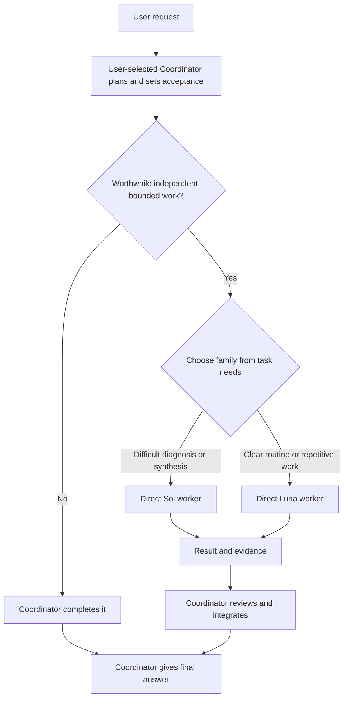

# Codex Native Workers

Keep the Coordinator you choose in charge while native GPT-5.6 Sol and Luna workers execute worthwhile, bounded tasks.

[简体中文](README.zh-CN.md)

[](https://github.com/SuperDaddyV/codex-sol-luna-worker/releases/tag/v4.1.4)
[](https://github.com/SuperDaddyV/codex-sol-luna-worker/releases/tag/v4.2.0-rc1)
[](https://github.com/SuperDaddyV/codex-sol-luna-worker/actions/workflows/validate.yml)
[](LICENSE)

> [!IMPORTANT]
> This is an independent community project. It is not affiliated with, sponsored by, or endorsed by OpenAI or ModelDial.

## What it is

The v4.2 preview of Codex Native Workers separates the user-selected **Coordinator** from two direct native worker families:

- **The Coordinator owns the task.** It keeps requirements, scope, architecture, ambiguity resolution, routing, integration, final acceptance, and the final answer. Astra is one Coordinator example; the package does not select or install the Coordinator model.
- **Sol handles difficult bounded execution.** Use it for diagnosis, synthesis, cross-module reasoning, and other complex work with a clear boundary.
- **Luna handles clear bounded execution.** Use it for well-specified implementation, extraction, targeted inspection, tests, builds, and repetitive work.

The display name is new. The `codex-sol-luna-worker` repository slug, installed paths, managed markers, and the three `sol-luna-*` Skill names remain backward compatible.

This is a configuration and routing package for local Codex clients. It does not include model access, credits, or a separate agent engine. Installation is user-wide; project-specific instructions and the client's actual capabilities still apply.

## Choose your version

| What you need | Version | What you get |
| --- | --- | --- |
| The Coordinator + Sol + Luna workflow described above | **v4.2.0-rc1 Preview** | Your chosen Coordinator, five Sol and five Luna profiles, three Skills. Opt in to the disclosed preview limits. |
| The existing stable workflow | **v4.1.4 Stable (default)** | Legacy Sol planner + five Luna worker profiles. It does **not** install Sol worker profiles or the new three-Skill workflow. |

Choose one installation prompt below. Fresh users should not run both; existing Stable users can upgrade by running only the Preview prompt. An existing rc1 installation needs no reinstall for this documentation update; never downgrade automatically. GitHub's **Latest** badge and `/releases/latest` still identify Stable, not the newest prerelease. [Installation help and troubleshooting](INSTALLATION.md) explains prerequisites, verification, and recovery.

## v4.2.0-rc1 preview

**Published preview:** [`v4.2.0-rc1`](https://github.com/SuperDaddyV/codex-sol-luna-worker/releases/tag/v4.2.0-rc1). Source: `527b174df13643a38bfe29652208eaa00f63fbf7`. Stable remains `v4.1.4`.

Start a new local Codex task with access to your computer's shell, then paste the complete prompt below. It works for a fresh installation or an upgrade. The [published installation contract](https://github.com/SuperDaddyV/codex-sol-luna-worker/blob/527b174df13643a38bfe29652208eaa00f63fbf7/NATIVE_WORKERS_PREVIEW.md) is pinned to the released source.

```text
Install or upgrade to Codex Native Workers v4.2.0-rc1 Preview. I accept its
published preview limits. Read and follow this immutable installation contract:
https://raw.githubusercontent.com/SuperDaddyV/codex-sol-luna-worker/527b174df13643a38bfe29652208eaa00f63fbf7/NATIVE_WORKERS_PREVIEW.md

Verify the published, non-draft GitHub Prerelease and resolve its tag to the
40-hex commit 527b174df13643a38bfe29652208eaa00f63fbf7. Use a clean detached
checkout and read the remote tag again; stop if it moved. Do not install from
master, target_commitish, a moving branch, or an unverified tag.
Before changing managed files, check all prerequisites together: codex, Git,
Python 3.11+ with tomllib available as the actual `python` command, HTTPS access,
native custom-agent support, model access, and both actual installation roots.
Show the preview notice, preserve my Coordinator settings and unrelated content,
then run dry-run and apply with the verified source commit and explicit roots.
Use the transaction-aware installer only. Stop on ownership or integrity conflicts;
do not overwrite them. Ask only for missing authorization for system-level repairs.
Do not downgrade or rewrite an already matching installation. Finish with the
installed identity, backup location, remaining blockers, and exact next action.
Explain any required reload; then follow the installed delegation Skill once for
useful bounded Sol/Luna verification. Report configuration and actual runtime
results separately. Do not stop at a plan or call configuration readiness full success.
```

The [release validation record](https://github.com/SuperDaddyV/codex-sol-luna-worker/releases/download/v4.2.0-rc1/native-workers-rc1-validation.json) includes three-platform source CI and a Windows installation/native-work scenario. This is not a measured installation success rate or native validation on every platform. GitHub's **Source code** archives are source, not a one-click installer; do not manually copy managed files. The [contract overview](NATIVE_WORKERS_PREVIEW.md) is explanatory; the prompt uses the immutable released contract.

The preview keeps each worker role configured with `[agents] enabled = false` and explicitly prohibits workers from delegating. Those are configuration and policy requests, not proof of host enforcement. The release record for Desktop `0.155.0-alpha.9.2` preserves **FAIL** for Sol tool visibility; a post-install Luna child reported no collaboration definitions but did report a task-messaging tool. Nested invocation was **NOT RUN**, and invocation enforcement remains **UNKNOWN**. Strong recursive isolation therefore remains unsupported.

## How Coordinator and workers collaborate

The Coordinator delegates only when an independent bounded task is worthwhile. It sends a Task Contract containing Goal, Scope, Constraints, Acceptance Criteria, and Verification, then reviews every returned result.



- **Routing:** choose the family from the task before checking availability. Sol uses `general` by default, with `backend`, `frontend`, or `reasoning` views when the work fits; Luna has one Daily role.
- **Parallel:** normally use 0–3 workers. Expand to 4–6 only for ready, independent work with non-overlapping writes and actual host capacity. Three-worker overlap has been observed on the host with pre-rc1 installed roles; the configured maximum of six is unverified.
- **Sequential:** run dependent work or overlapping edits in order.
- **Coordinator-only:** keep small tasks, ambiguity, architecture, unsafe splits, and final acceptance with the Coordinator.

There is no fixed Sol quota. Availability alone does not justify switching a task between Sol and Luna. The Daily Selector chooses the current worker profiles and efforts; it does not choose the Coordinator or decide whether work is worth delegating. The installed profiles use `low`, `medium`, `high`, `xhigh`, or `max`; they do not use `ultra`.

All agents share the current workspace, so parallel writers need disjoint ownership. Workers are instructed to remain direct leaves and must not spawn or delegate further, but configuration alone is not runtime enforcement.

For a substantive workflow, the final line reports actual execution in the current format:

```text
Coordinator/Workers: delegated · sol_high ×1
Coordinator/Workers: delegated · luna_high ×2 · parallel
Coordinator/Workers: Coordinator-only · too small
Coordinator/Workers: Coordinator-only · no independent work
```

A receipt summarizes observed task facts; it is not runtime attestation and makes no savings claim.

## Core value

- **Native workers:** uses Codex custom agents and subagents without a Hook Router or custom orchestration engine.
- **Small global policy:** keeps the managed Global block within 2 KiB and moves conditional workflows into `sol-luna-delegate`, `sol-luna-status`, and `sol-luna-upgrade`.
- **Validated daily routing:** chooses Sol and Luna profiles from public benchmark reference data. A `reference_only` choice is not local runtime evidence; missing comparable costs produces quality-only selection, never a billing or quota-savings claim.
- **Configuration protection and recovery:** preserves unrelated user configuration, fails closed on conflicts, and uses transaction backups for supported rollback and safe uninstall.

## Requirements

- Codex Desktop or another current Codex client with custom-agent and subagent support.
- A working `codex` command in the task environment. Codex Desktop alone is not sufficient if `codex --version` cannot run.
- Access to the user-selected Coordinator model and, for the preview, GPT-5.6 Sol and GPT-5.6 Luna at the required effort levels.
- Python 3.11 or newer with `tomllib`, plus Git for the required immutable exact-commit checkout. Installed policy and Skill selector commands invoke **`python`**; having only `python3` or `py` is insufficient until `python` works in Codex's execution environment.
- Read-only HTTPS access to GitHub and ModelDial's public reference data for first-time daily selection. Model availability comes from your Codex account, not the benchmark website.
- Windows, Ubuntu/Linux, or macOS. Treat WSL as a separate Linux environment.

## Stable installation (default)

This installs the legacy Sol-planner/Luna-worker architecture, not the v4.2 dual-worker-family workflow. Use the preview prompt above if you need Sol as a worker.

Start a new Codex task with a capable Coordinator and paste this single prompt:

```text
Read and strictly execute the assisted installation contract at:

https://raw.githubusercontent.com/SuperDaddyV/codex-sol-luna-worker/7494d47574ac751e76a231033a0ed91686899a07/CODEX_SOL_LUNA_INSTALL_ASSIST.md

Install the pinned v4.1.4 Stable target. Diagnose all independent prerequisites
in one pass. Before managed writes, also require this command to pass in the
actual Codex task environment; installed selector commands use literal python:
python -c "import sys, tomllib; assert sys.version_info >= (3, 11); print(sys.version)"
Apply only the contract's safe automatic recovery. Before any
package install, administrator elevation, or persistent environment change,
show one exact official-source recovery proposal and wait for my explicit
approval. After approval, recheck and continue automatically. Never change
authentication, proxy, certificate trust, sandbox, organization policy, or
unrelated user configuration. Once Ready: YES, follow the pinned setup contract
and installer exactly. After installation, tell me how to reload Codex and
provide the fresh-task smoke continuation.
```

The pinned [Assisted Installation contract](https://github.com/SuperDaddyV/codex-sol-luna-worker/blob/7494d47574ac751e76a231033a0ed91686899a07/CODEX_SOL_LUNA_INSTALL_ASSIST.md) is the Stable installation entry; the [Chinese translation](CODEX_SOL_LUNA_INSTALL_ASSIST.zh-CN.md) is for review. It fixes installation to the reviewed [v4.1.4 Setup contract](https://github.com/SuperDaddyV/codex-sol-luna-worker/blob/bf01c438eae66f5ef9a27d401c6ee845f89d5d59/CODEX_SOL_LUNA_SETUP.md) and verified source `6a537b445ad6f17a9600c05e655f51a2844bfcc8`, so Codex does not install from a moving branch.

> [!WARNING]
> Never replace the immutable Stable installation URL with `master`, a tag, or another mutable entry. System changes require explicit approval. The installer fails closed on ownership conflicts and creates a transaction backup before changes, but no installation is risk-free.

After installation, reload Codex when instructed and start a new task so the global instructions, agents, and configuration are loaded.

## Daily use

Use Codex normally. The Coordinator decides whether a task contains worthwhile bounded work and which worker family fits; not every prompt should create a worker.

```text
Review this project, route difficult diagnosis and routine test fixes to the
appropriate workers where worthwhile, then verify and integrate the result.
```

```text
Inspect these modules for inconsistent configuration and report the findings
without changing files.
```

```text
Review the frontend, backend, and tests as independent scopes where safe, then
give me one final assessment.
```

The Coordinator still owns routing, overlap decisions, review, and the final answer.

## Confirm it is working

In a fresh Codex task, run this read-only status command:

```text
Check Sol/Luna status.
```

For `v4.2.0-rc1`, diagnostic schema 4 separates installation/configuration from native runtime evidence. `Status Healthy`, `Agents 10/10 Ready`, `Skills 3/3 Ready`, and `leaf_config Ready` describe configuration only. Actual native delegation, tool isolation, invocation-guard behavior, and observed maximum parallelism require separate runtime checks. A configured limit of six is not measured capacity.

The v4.1.4 Stable status shape may instead show `Agents 5/5 Ready`. Its historical compatibility smoke exercises Luna-only behavior and is not acceptance of the two-family v4.2 preview.

`Today Selection not initialized` can be normal immediately after installation. Status is read-only and does not initialize it. During the first worthwhile delegation, let the installed `sol-luna-delegate` Skill select once and reuse that result. If selection or role loading fails, report it and keep the work with the Coordinator; do not guess a role. See [installation checkpoints and common failures](INSTALLATION.md).

For deeper checks after installation or a Codex update, follow [Runtime checks](RUNTIME_TESTS.md). A status result, source test, or receipt alone is not full runtime acceptance.

## Upgrade, rollback, and uninstall

- **Upgrade:** an existing installation can ask `Upgrade Sol/Luna to the latest version`. This **includes prereleases**; use the version-specific prompt above to pin rc1, or explicitly request Stable-only if that is what you want. The installed `sol-luna-upgrade` Skill applies only a verified immutable target.
- **Rollback:** use the exact transaction backup returned by the installer. A successful rollback restores the verified pre-change state.
- **Uninstall:** use the installer's manifest-owned uninstall flow; do not hand-edit managed TOML, Skill, or agent files.

Reload Codex and start a new task after an upgrade, rollback, or uninstall. Stable commands, stop conditions, ownership rules, and backup behavior remain defined in the immutable [v4.1.4 Setup contract](https://github.com/SuperDaddyV/codex-sol-luna-worker/blob/bf01c438eae66f5ef9a27d401c6ee845f89d5d59/CODEX_SOL_LUNA_SETUP.md).

## Technical documentation

- [Installation help and troubleshooting](INSTALLATION.md)
- [v4.2.0-rc1 preview installation](NATIVE_WORKERS_PREVIEW.md)
- [Stable installation, upgrade, rollback, and uninstall](https://github.com/SuperDaddyV/codex-sol-luna-worker/blob/bf01c438eae66f5ef9a27d401c6ee845f89d5d59/CODEX_SOL_LUNA_SETUP.md)
- [Architecture](ARCHITECTURE.md)
- [Runtime evidence](RUNTIME_TESTS.md)
- [Security boundaries](SECURITY.md)
- [Version history](CHANGELOG.md)
- [GitHub Releases](https://github.com/SuperDaddyV/codex-sol-luna-worker/releases)

## Feedback

- [Bug Report](https://github.com/SuperDaddyV/codex-sol-luna-worker/issues/new?template=bug-report.yml)
- [Compatibility Report](https://github.com/SuperDaddyV/codex-sol-luna-worker/issues/new?template=compatibility-report.yml)
- [Feature / Feedback](https://github.com/SuperDaddyV/codex-sol-luna-worker/issues/new?template=feature-feedback.yml)

Before submitting, remove secrets and private information, share only the minimum relevant logs, and do not upload the entire `CODEX_HOME`.

## License

[MIT](LICENSE)

ModelDial-derived test data under `fixtures/modeldial/` is attributed separately in [its fixture notice](fixtures/modeldial/README.md) under CC BY 4.0; this does not change the source-code license.
