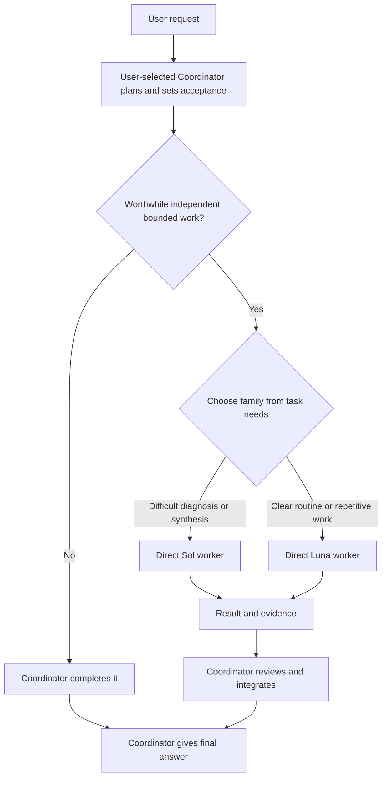

# Codex Native Workers

Keep the Coordinator you choose in charge while native GPT-5.6 Sol and Luna workers execute worthwhile, bounded tasks.

[简体中文](README.zh-CN.md)

[](https://github.com/SuperDaddyV/codex-sol-luna-worker/releases/tag/v4.1.4)
[](https://github.com/SuperDaddyV/codex-sol-luna-worker/actions/workflows/validate.yml)
[](LICENSE)

> [!IMPORTANT]
> This is an independent community project. It is not affiliated with, sponsored by, or endorsed by OpenAI or ModelDial.

## What it is

Codex Native Workers separates the user-selected **Coordinator** from two direct native worker families:

- **The Coordinator owns the task.** It keeps requirements, scope, architecture, ambiguity resolution, routing, integration, final acceptance, and the final answer. Astra is one Coordinator example; the package does not select or install the Coordinator model.
- **Sol handles difficult bounded execution.** Use it for diagnosis, synthesis, cross-module reasoning, and other complex work with a clear boundary.
- **Luna handles clear bounded execution.** Use it for well-specified implementation, extraction, targeted inspection, tests, builds, and repetitive work.

The display name is new. The `codex-sol-luna-worker` repository slug, installed paths, managed markers, and the three `sol-luna-*` Skill names remain backward compatible.

## v4.2.0-rc1 preview

**Preview target:** [`v4.2.0-rc1`](https://github.com/SuperDaddyV/codex-sol-luna-worker/releases/tag/v4.2.0-rc1). It is a prerelease target and does not replace `v4.1.4` as the current Stable release or default Stable installation.

Read the [v4.2.0-rc1 preview installation contract](NATIVE_WORKERS_PREVIEW.md) before using this prompt:

```text
Install the Codex Native Workers v4.2.0-rc1 preview only if its published,
non-draft GitHub Prerelease exists.

Read that published Release. Resolve tag v4.2.0-rc1 to one exact 40-hex commit,
acquire a clean detached checkout, and then read the remote tag again; stop if it
moved. Read NATIVE_WORKERS_PREVIEW.md from that exact commit, inspect it, and
follow its contract. Do not install from master, target_commitish, a moving
branch, or an unverified tag. Before any write, disclose that this is a
Prerelease / Public Beta and that strong host-enforced prevention of recursive
worker delegation is unsupported.
```

This README does not claim that the preview Release is already published. After it is published, an existing installation can use the installed `sol-luna-upgrade` Skill through an explicit upgrade request; release discovery, immutable-tag checks, dry-run, and transactional apply still govern the upgrade.

The preview keeps each worker role configured with `[agents] enabled = false` and explicitly prohibits workers from delegating. Those are configuration and policy requests, not proof of host enforcement. Current host evidence relevant to the preview, recorded before an rc1 installation on Desktop `0.155.0-alpha.9.2`, is **FAIL** for Sol tool visibility, **UNKNOWN** for the Luna tool report, and **NOT RUN** for nested invocation. Strong recursive isolation therefore remains unsupported.

## How Coordinator and workers collaborate

The Coordinator delegates only when an independent bounded task is worthwhile. It sends a Task Contract containing Goal, Scope, Constraints, Acceptance Criteria, and Verification, then reviews every returned result.



- **Routing:** choose the family from the task before checking availability. Sol uses `general` by default, with `backend`, `frontend`, or `reasoning` views when the work fits; Luna has one Daily role.
- **Parallel:** normally use 0–3 workers. Expand to 4–6 only for ready, independent work with non-overlapping writes and actual host capacity. Three-worker overlap has been observed; the configured maximum of six is unverified.
- **Sequential:** run dependent work or overlapping edits in order.
- **Coordinator-only:** keep small tasks, ambiguity, architecture, unsafe splits, and final acceptance with the Coordinator.

There is no fixed Sol quota. Availability alone does not justify switching a task between Sol and Luna. The Daily Selector chooses the current worker profiles and efforts; it does not choose the Coordinator or decide whether work is worth delegating. The installed profiles use `low`, `medium`, `high`, `xhigh`, or `max`; they do not use `ultra`.

All agents share the current workspace, so parallel writers need disjoint ownership. Workers are instructed to remain direct leaves and must not spawn or delegate further, but configuration alone is not runtime enforcement.

For a substantive workflow, the final line reports actual execution in the current format:

```text
Coordinator/Workers: delegated · sol_high ×1
Coordinator/Workers: delegated · luna_high ×2 · parallel
Coordinator/Workers: Coordinator-only · too small
Coordinator/Workers: Coordinator-only · no independent work
```

A receipt summarizes observed task facts; it is not runtime attestation and makes no savings claim.

## Core value

- **Native workers:** uses Codex custom agents and subagents without a Hook Router or custom orchestration engine.
- **Small global policy:** keeps the managed Global block within 2 KiB and moves conditional workflows into `sol-luna-delegate`, `sol-luna-status`, and `sol-luna-upgrade`.
- **Validated daily routing:** chooses Sol and Luna profiles from public benchmark reference data. A `reference_only` choice is not local runtime evidence; missing comparable costs produces quality-only selection, never a billing or quota-savings claim.
- **Configuration protection and recovery:** preserves unrelated user configuration, fails closed on conflicts, and uses transaction backups for supported rollback and safe uninstall.

## Requirements

- Codex Desktop or another current Codex client with custom-agent and subagent support.
- A working `codex` command in the task environment. Codex Desktop alone is not sufficient if `codex --version` cannot run.
- Access to the user-selected Coordinator model and, for the preview, GPT-5.6 Sol and GPT-5.6 Luna at the required effort levels.
- Python 3.11 or newer with `tomllib`, plus Git for the required immutable exact-commit checkout.
- Read-only HTTPS access to this public GitHub repository.
- Windows, Ubuntu/Linux, or macOS. Treat WSL as a separate Linux environment.

## Stable installation (default)

Start a new Codex task with a capable Coordinator and paste this single prompt:

```text
Read and strictly execute the assisted installation contract at:

https://raw.githubusercontent.com/SuperDaddyV/codex-sol-luna-worker/7494d47574ac751e76a231033a0ed91686899a07/CODEX_SOL_LUNA_INSTALL_ASSIST.md

Install the pinned v4.1.4 Stable target. Diagnose all independent prerequisites
in one pass. Apply only the contract's safe automatic recovery. Before any
package install, administrator elevation, or persistent environment change,
show one exact official-source recovery proposal and wait for my explicit
approval. After approval, recheck and continue automatically. Never change
authentication, proxy, certificate trust, sandbox, organization policy, or
unrelated user configuration. Once Ready: YES, follow the pinned setup contract
and installer exactly. After installation, tell me how to reload Codex and
provide the fresh-task smoke continuation.
```

The pinned [Assisted Installation contract](https://github.com/SuperDaddyV/codex-sol-luna-worker/blob/7494d47574ac751e76a231033a0ed91686899a07/CODEX_SOL_LUNA_INSTALL_ASSIST.md) is the Stable installation entry; the [Chinese translation](CODEX_SOL_LUNA_INSTALL_ASSIST.zh-CN.md) is for review. It fixes installation to the reviewed [v4.1.4 Setup contract](https://github.com/SuperDaddyV/codex-sol-luna-worker/blob/bf01c438eae66f5ef9a27d401c6ee845f89d5d59/CODEX_SOL_LUNA_SETUP.md) and verified source `6a537b445ad6f17a9600c05e655f51a2844bfcc8`, so Codex does not install from a moving branch.

> [!WARNING]
> Never replace the immutable Stable installation URL with `master`, a tag, or another mutable entry. System changes require explicit approval. The installer fails closed on ownership conflicts and creates a transaction backup before changes, but no installation is risk-free.

After installation, reload Codex when instructed and start a new task so the global instructions, agents, and configuration are loaded.

## Daily use

Use Codex normally. The Coordinator decides whether a task contains worthwhile bounded work and which worker family fits; not every prompt should create a worker.

```text
Review this project, route difficult diagnosis and routine test fixes to the
appropriate workers where worthwhile, then verify and integrate the result.
```

```text
Inspect these modules for inconsistent configuration and report the findings
without changing files.
```

```text
Review the frontend, backend, and tests as independent scopes where safe, then
give me one final assessment.
```

The Coordinator still owns routing, overlap decisions, review, and the final answer.

## Confirm it is working

In a fresh Codex task, run this read-only status command:

```text
Check Sol/Luna status.
```

For `v4.2.0-rc1`, diagnostic schema 4 separates installation/configuration from native runtime evidence. `Status Healthy`, `Agents 10/10 Ready`, `Skills 3/3 Ready`, and `leaf_config Ready` describe configuration only. Actual native delegation, tool isolation, invocation-guard behavior, and observed maximum parallelism require separate runtime checks. A configured limit of six is not measured capacity.

The v4.1.4 Stable status shape may instead show `Agents 5/5 Ready`. Its historical compatibility smoke exercises Luna-only behavior and is not acceptance of the two-family v4.2 preview.

For deeper checks after installation or a Codex update, follow [Runtime checks](RUNTIME_TESTS.md). A status result, source test, or receipt alone is not full runtime acceptance.

## Upgrade, rollback, and uninstall

- **Upgrade:** after the preview is published, an existing installation can ask `Upgrade Sol/Luna to the latest version`. The installed `sol-luna-upgrade` Skill discovers published releases, including prereleases, and applies only a verified immutable target.
- **Rollback:** use the exact transaction backup returned by the installer. A successful rollback restores the verified pre-change state.
- **Uninstall:** use the installer's manifest-owned uninstall flow; do not hand-edit managed TOML, Skill, or agent files.

Reload Codex and start a new task after an upgrade, rollback, or uninstall. Stable commands, stop conditions, ownership rules, and backup behavior remain defined in the immutable [v4.1.4 Setup contract](https://github.com/SuperDaddyV/codex-sol-luna-worker/blob/bf01c438eae66f5ef9a27d401c6ee845f89d5d59/CODEX_SOL_LUNA_SETUP.md).

## Technical documentation

- [v4.2.0-rc1 preview installation](NATIVE_WORKERS_PREVIEW.md)
- [Stable installation, upgrade, rollback, and uninstall](https://github.com/SuperDaddyV/codex-sol-luna-worker/blob/bf01c438eae66f5ef9a27d401c6ee845f89d5d59/CODEX_SOL_LUNA_SETUP.md)
- [Architecture](ARCHITECTURE.md)
- [Runtime evidence](RUNTIME_TESTS.md)
- [Security boundaries](SECURITY.md)
- [Version history](CHANGELOG.md)
- [GitHub Releases](https://github.com/SuperDaddyV/codex-sol-luna-worker/releases)

## Feedback

- [Bug Report](https://github.com/SuperDaddyV/codex-sol-luna-worker/issues/new?template=bug-report.yml)
- [Compatibility Report](https://github.com/SuperDaddyV/codex-sol-luna-worker/issues/new?template=compatibility-report.yml)
- [Feature / Feedback](https://github.com/SuperDaddyV/codex-sol-luna-worker/issues/new?template=feature-feedback.yml)

Before submitting, remove secrets and private information, share only the minimum relevant logs, and do not upload the entire `CODEX_HOME`.

## License

[MIT](LICENSE)

ModelDial-derived test data under `fixtures/modeldial/` is attributed separately in [its fixture notice](fixtures/modeldial/README.md) under CC BY 4.0; this does not change the source-code license.
