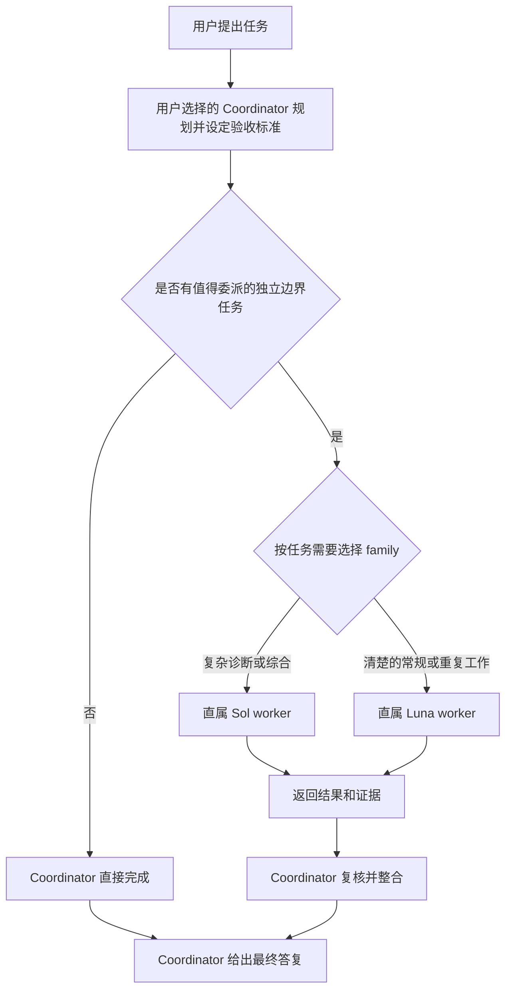

# Codex Native Workers

由你选择的 Coordinator 掌握任务，原生 GPT-5.6 Sol 与 Luna worker 执行值得委派、边界清楚的工作。

[English](README.md)

[](https://github.com/SuperDaddyV/codex-sol-luna-worker/releases/tag/v4.1.4)
[](https://github.com/SuperDaddyV/codex-sol-luna-worker/releases/tag/v4.2.0-rc1)
[](https://github.com/SuperDaddyV/codex-sol-luna-worker/actions/workflows/validate.yml)
[](LICENSE)

> [!IMPORTANT]
> 这是独立的社区项目，与 OpenAI、ModelDial 均无隶属、赞助或背书关系。

## 这是什么

Codex Native Workers 的 v4.2 预览版把用户选择的 **Coordinator** 与两类直属原生 worker 分开：

- **Coordinator 掌握整个任务。** 它负责需求、范围、架构、歧义处理、路由、整合、最终验收和最终答复。Astra 只是 Coordinator 的一个示例；本项目不会选择或安装 Coordinator 模型。
- **Sol 执行复杂的边界任务。** 适合诊断、综合、跨模块推理，以及其他范围清楚但难度较高的执行工作。
- **Luna 执行清楚的边界任务。** 适合定义充分的实现、提取、定向检查、测试、构建和重复性工作。

新的只是展示名称。仓库 slug `codex-sol-luna-worker`、安装路径、托管标记和三个 `sol-luna-*` Skill 名称保持向后兼容。

这是面向本地 Codex 客户端的配置与路由包，不提供模型权限、额度或独立代理引擎。安装作用于当前用户；具体项目的 instructions 和客户端实际能力仍然生效。

## 选择版本

| 你的需求 | 版本 | 实际获得的功能 |
| --- | --- | --- |
| 使用上面介绍的 Coordinator + Sol + Luna 方案 | **v4.2.0-rc1 Preview** | 自选 Coordinator、5 个 Sol 和 5 个 Luna 档位、3 个 Skills；需接受已披露的预览限制。 |
| 保持现有稳定方案 | **v4.1.4 Stable（默认）** | 旧版 Sol 主控 + 5 个 Luna worker 档位；**不包含 Sol 子代理档位，也不是新版三个 Skills 的流程**。 |

下面两个安装提示词只选一个。新用户不要都运行一遍；已安装 Stable 的用户可只运行 Preview 提示词完成升级。已经安装 rc1 的用户不需要因本次文档更新重新安装，也不要自动降级。GitHub 的 **Latest** 标记和 `/releases/latest` 仍指向 Stable，不是最新预览版。前置条件、验收和恢复见[安装帮助与故障排查](INSTALLATION.zh-CN.md)。

## v4.2.0-rc1 预览版

**已发布预览版：**[`v4.2.0-rc1`](https://github.com/SuperDaddyV/codex-sol-luna-worker/releases/tag/v4.2.0-rc1)。源码：`527b174df13643a38bfe29652208eaa00f63fbf7`。Stable 仍为 `v4.1.4`。

新建一个能够执行本机 shell 命令的 Codex 任务，完整复制下面提示词；首次安装和从旧版升级都可使用。[已发布安装合同](https://github.com/SuperDaddyV/codex-sol-luna-worker/blob/527b174df13643a38bfe29652208eaa00f63fbf7/NATIVE_WORKERS_PREVIEW.md)已固定到发布源码。

```text
请安装或升级到 Codex Native Workers v4.2.0-rc1 Preview；我接受其已披露的
预览限制。读取并遵循以下不可变安装合同：
https://raw.githubusercontent.com/SuperDaddyV/codex-sol-luna-worker/527b174df13643a38bfe29652208eaa00f63fbf7/NATIVE_WORKERS_PREVIEW.md

核验已发布、非 draft 的 GitHub Prerelease，将 tag 解析到精确的 40-hex commit
527b174df13643a38bfe29652208eaa00f63fbf7。使用干净的 detached checkout，
再次读取远端 tag；如有移动立即停止。不得从 master、target_commitish、可变分支
或未经验证的 tag 安装。
修改托管文件前，一次性检查 codex、Git、实际 python 命令能运行 Python 3.11+
并导入 tomllib、HTTPS、原生 custom agents、模型权限和两个实际安装目录。
展示预览提示，保留我的 Coordinator 设置和无关内容；带精确源码与两个明确目录
执行 dry-run，再通过事务安装器 apply。遇到 ownership 或完整性冲突就停止，
不要覆盖冲突；仅对尚未授权的系统级修复请求必要批准。
不要降级；已匹配目标的安装不重复写入。交付时说明安装版本和源码、备份位置、
遗留阻断和具体下一步，必要时提示重新加载客户端，再按已安装的委派 Skill
选择一次，完成有实际用途的 Sol/Luna 有界验证。分别报告配置与真实运行结果，
不要只给计划，也不要把配置就绪当成完整安装验收成功。
```

[发布验收记录](https://github.com/SuperDaddyV/codex-sol-luna-worker/releases/download/v4.2.0-rc1/native-workers-rc1-validation.json)包含三平台源码 CI，以及一个 Windows 本地安装和原生工作场景。这不是安装成功率统计，也不等于所有平台的原生运行均已验证。GitHub 的 **Source code** 压缩包是源码，不是一键安装程序，不要手工复制托管文件。[合同概览](NATIVE_WORKERS_PREVIEW.md)便于阅读；提示词执行的是固定到发布源码的合同。

预览版在每个 worker role 中保留 `[agents] enabled = false`，并明确禁止 worker 继续委派。这些是配置与策略请求，不是宿主强制执行的证明。Desktop `0.155.0-alpha.9.2` 的发布记录保留 Sol tool visibility 为 **FAIL**；安装后的 Luna child 报告未暴露 collaboration 定义，但仍有任务消息工具。nested invocation 为 **NOT RUN**，调用防护为 **UNKNOWN**。因此，强递归隔离仍不受支持。

## Coordinator 与 worker 如何协作

Coordinator 只委派值得执行的独立边界任务。它发送包含 Goal、Scope、Constraints、Acceptance Criteria 和 Verification 的 Task Contract，然后复核每一份返回结果。



- **路由：** 先按任务需要选择 family，再检查可用性。Sol 默认使用 `general`，工作明确匹配时可用 `backend`、`frontend` 或 `reasoning` view；Luna 每天只有一个 Daily role。
- **并行：** 通常使用 0–3 个 worker。只有任务全部就绪、彼此独立、写入范围不重叠且宿主实际容量支持时，才扩展到 4–6 个。已观察到三个 worker 重叠执行，使用的是宿主中 rc1 之前安装的角色；配置上限六个尚未验证。
- **串行：** 有依赖的工作或重叠修改按顺序执行。
- **Coordinator-only：** 小任务、歧义、架构、无法安全拆分的工作和最终验收由 Coordinator 保留。

Sol 没有固定配额。不能仅因可用性就在 Sol 与 Luna 之间切换任务。Daily Selector 决定当前 worker profile 与 effort；它不选择 Coordinator，也不决定工作是否值得委派。已安装的 profile 使用 `low`、`medium`、`high`、`xhigh` 或 `max`，不使用 `ultra`。

所有 agent 共享当前工作区，因此并行 writer 必须拥有互不重叠的范围。worker 被要求保持直属 leaf，不得继续 spawn 或 delegate；但配置本身不等于 runtime enforcement。

对于非简单工作流，最后一行按当前格式报告实际执行方式：

```text
Coordinator/Workers: delegated · sol_high ×1
Coordinator/Workers: delegated · luna_high ×2 · parallel
Coordinator/Workers: Coordinator-only · too small
Coordinator/Workers: Coordinator-only · no independent work
```

Receipt 只汇总已观察到的任务事实，不是 runtime attestation，也不会声称节省额度。

## 核心价值

- **原生 worker：** 使用 Codex custom agents 和 subagents，不需要 Hook Router 或自建编排引擎。
- **精简 Global 策略：** 托管 Global block 不超过 2 KiB，条件工作流放在 `sol-luna-delegate`、`sol-luna-status` 和 `sol-luna-upgrade` 中。
- **经过校验的每日路由：** 根据公共 benchmark reference data 选择 Sol 与 Luna profile。`reference_only` 选择不是本地 runtime 证据；缺少可比成本时使用 quality-only 选择，绝不据此声称实际账单或额度节省。
- **配置保护和可恢复：** 保留无关用户配置，遇到冲突 fail closed，并通过事务备份支持受控回滚和安全卸载。

## 系统要求

- Codex Desktop，或其他支持 custom agent 与 subagent 的当前 Codex 客户端。
- 当前任务环境可执行 `codex` 命令；如果 `codex --version` 不能运行，仅安装 Codex Desktop 还不够。
- 账号可使用用户选择的 Coordinator 模型；使用预览版时，还须可使用所需 effort 的 GPT-5.6 Sol 与 GPT-5.6 Luna。
- Python 3.11 或更高版本并包含 `tomllib`，以及用于不可变精确 commit checkout 的 Git。已安装的 policy 与 Skill 选择器命令固定调用 **`python`**；只有 `python3` 或 `py` 可用还不够，需确认 Codex 执行环境中的 `python` 可用。
- 能以只读 HTTPS 访问 GitHub，以及首次每日选择所需的 ModelDial 公共参考数据。模型调用权限来自 Codex 账号，不来自雷达网站。
- Windows、Ubuntu/Linux 或 macOS。WSL 应视为独立 Linux 环境。

## Stable 安装（默认）

这个入口安装的是旧版 Sol 主控／Luna 执行架构，不是 v4.2 双家族 worker 方案。需要 Sol 做子代理，请使用上面的 Preview 提示词。

使用能力合适的 Coordinator 新建一个 Codex 任务，然后只粘贴下面这一个提示词：

```text
请读取并严格执行以下安装协助合同：

https://raw.githubusercontent.com/SuperDaddyV/codex-sol-luna-worker/7494d47574ac751e76a231033a0ed91686899a07/CODEX_SOL_LUNA_INSTALL_ASSIST.md

安装固定的 v4.1.4 Stable 目标。一次性诊断全部彼此独立的前置条件。
写入托管文件前，还须在实际 Codex 任务环境中通过以下检查，因为已安装选择器固定调用 python：
python -c "import sys, tomllib; assert sys.version_info >= (3, 11); print(sys.version)"
只自动执行合同允许的安全修复。安装软件包、提升管理员权限或持久修改环境前，
先给出一份来自官方来源的准确修复方案并等待我的明确确认。获得确认后自动复检并续跑。
不得修改认证、代理、证书信任、sandbox、组织策略或无关用户配置。
Ready: YES 后严格执行合同固定的 setup contract 和现有安装器。
安装后告诉我如何重新加载 Codex，并给出新任务 smoke 的续接内容。
```

固定的 [Assisted Installation contract](https://github.com/SuperDaddyV/codex-sol-luna-worker/blob/7494d47574ac751e76a231033a0ed91686899a07/CODEX_SOL_LUNA_INSTALL_ASSIST.md) 是 Stable 安装入口；[中文审阅版](CODEX_SOL_LUNA_INSTALL_ASSIST.zh-CN.md)仅供核对。它把安装固定到经过审查的 [v4.1.4 Setup contract](https://github.com/SuperDaddyV/codex-sol-luna-worker/blob/bf01c438eae66f5ef9a27d401c6ee845f89d5d59/CODEX_SOL_LUNA_SETUP.md) 和已验证源 `6a537b445ad6f17a9600c05e655f51a2844bfcc8`，避免 Codex 从可变分支安装。

> [!WARNING]
> 不得把 Stable 的不可变安装 URL 改成 `master`、tag 或其他可变入口。系统变更必须获得明确确认。安装器在 ownership 冲突时 fail closed，并在变更前创建事务备份；但任何安装都不能承诺绝对无风险。

安装完成后，按提示重新加载 Codex 并新建任务，让全局 instructions、agents 和 configuration 进入新任务。

## 日常使用

像平时一样使用 Codex。Coordinator 判断任务是否包含值得委派的边界工作，以及哪类 worker 匹配；不是每个提示词都应创建 worker。

```text
请审查这个项目，在值得委派时把复杂诊断和常规测试修复路由给合适的 worker，
然后验证并整合结果。
```

```text
请检查这些模块是否存在不一致的配置，只报告发现，不要修改文件。
```

```text
在安全的前提下，把前端、后端和测试作为独立范围审查，最后给我一份统一结论。
```

路由、重叠范围处理、结果复核和最终答复仍由 Coordinator 负责。

## 如何确认生效

在新的 Codex 任务中运行这条只读 status 命令：

```text
检查 Sol/Luna 状态
```

对于 `v4.2.0-rc1`，diagnostic schema 4 把安装/配置与原生 runtime 证据分开。`Status Healthy`、`Agents 10/10 Ready`、`Skills 3/3 Ready` 和 `leaf_config Ready` 只说明配置状态。实际 native delegation、tool isolation、invocation guard 行为和观察到的最大并发量需要单独进行 runtime 检查。配置上限六个不等于实测容量。

v4.1.4 Stable 的 status 结构可能显示 `Agents 5/5 Ready`。其历史 compatibility smoke 只覆盖 Luna-only 行为，不是双 family v4.2 预览版的验收。

刚安装后的 `Today Selection not initialized` 可能是正常状态；status 只读，不会初始化。首次执行值得委派的任务时，由已安装的 `sol-luna-delegate` 选择一次并复用结果。若选择或角色加载失败，应说明原因并保留在 Coordinator，不要猜档位。详见[安装检查点与常见故障](INSTALLATION.zh-CN.md)。

安装后或 Codex 更新后，需要更深入检查时，按 [Runtime 检查](RUNTIME_TESTS.md) 执行。status、source test 或 receipt 本身都不等于完整 runtime acceptance。

## 升级、回滚与卸载

- **升级：** 现有安装可以说「升级 Sol/Luna 到最新版本」，这**包含 Prerelease**。要固定 rc1，请使用上面的版本专用提示词；只接受稳定版时请明确说 Stable-only。已安装的 `sol-luna-upgrade` Skill 只应用经过验证的不可变目标。
- **回滚：** 使用 installer 返回的精确 transaction backup；成功回滚会恢复经过校验的变更前状态。
- **卸载：** 使用 installer 的 manifest-owned uninstall 流程，不要手工编辑托管 TOML、Skill 或 agent 文件。

升级、回滚或卸载后重新加载 Codex 并新建任务。Stable 的具体命令、停止条件、ownership 规则和 backup 行为仍以不可变 [v4.1.4 Setup contract](https://github.com/SuperDaddyV/codex-sol-luna-worker/blob/bf01c438eae66f5ef9a27d401c6ee845f89d5d59/CODEX_SOL_LUNA_SETUP.md)为准。

## 技术文档

- [安装帮助与故障排查](INSTALLATION.zh-CN.md)
- [v4.2.0-rc1 预览版安装](NATIVE_WORKERS_PREVIEW.md)
- [Stable 安装、升级、回滚与卸载](https://github.com/SuperDaddyV/codex-sol-luna-worker/blob/bf01c438eae66f5ef9a27d401c6ee845f89d5d59/CODEX_SOL_LUNA_SETUP.md)
- [架构说明](ARCHITECTURE.md)
- [Runtime 证据](RUNTIME_TESTS.md)
- [安全边界](SECURITY.md)
- [版本历史](CHANGELOG.md)
- [GitHub Releases](https://github.com/SuperDaddyV/codex-sol-luna-worker/releases)

## 反馈

- [Bug Report](https://github.com/SuperDaddyV/codex-sol-luna-worker/issues/new?template=bug-report.yml)
- [Compatibility Report](https://github.com/SuperDaddyV/codex-sol-luna-worker/issues/new?template=compatibility-report.yml)
- [Feature / Feedback](https://github.com/SuperDaddyV/codex-sol-luna-worker/issues/new?template=feature-feedback.yml)

提交前删除或脱敏秘密与私有信息，只分享最小必要日志，不要上传整个 `CODEX_HOME`。

## License

[MIT](LICENSE)

`fixtures/modeldial/` 下由 ModelDial 数据派生的测试 fixture 依 CC BY 4.0 在[独立说明](fixtures/modeldial/README.md)中署名；项目源码许可证仍为 MIT。
