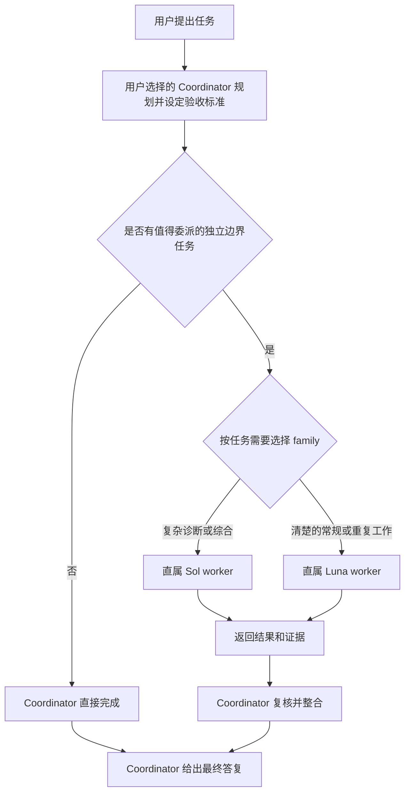

# Codex Native Workers

本分支是 **v4.3.0 验收候选**，尚未正式发布；当前已发布正式版仍为 [v4.2.0](https://github.com/SuperDaddyV/codex-native-workers/releases/tag/v4.2.0)。下面的 v4.3.0 安装提示词仅在正式 Release 发布后生效。

由你选择的 Coordinator 掌握任务，原生 GPT-6 Sol 与 Luna worker 执行值得委派、边界清楚的工作。

[English](README.md)

[](https://github.com/SuperDaddyV/codex-native-workers/releases/tag/v4.3.0)
[](https://github.com/SuperDaddyV/codex-native-workers/releases/tag/v4.2.0-rc1)
[](https://github.com/SuperDaddyV/codex-native-workers/actions/workflows/validate.yml)
[](LICENSE)

> [!IMPORTANT]
> 这是独立的社区项目，与 OpenAI、ModelDial 均无隶属、赞助或背书关系。

## 这是什么

Codex Native Workers v4.3 把用户选择的 **Coordinator** 与两类直属原生 worker 分开：

- **Coordinator 掌握整个任务。** 它负责需求、范围、架构、歧义处理、路由、整合、最终验收和最终答复。Astra 只是 Coordinator 的一个示例；本项目不会选择或安装 Coordinator 模型。
- **Sol 执行复杂的边界任务。** 适合诊断、综合、跨模块推理，以及其他范围清楚但难度较高的执行工作。
- **Luna 执行清楚的边界任务。** 适合定义充分的实现、提取、定向检查、测试、构建和重复性工作。

项目正式名称为 **Codex Native Workers**，GitHub 仓库为 **`SuperDaddyV/codex-native-workers`**。旧 `codex-sol-luna-worker` 链接重定向到新仓库；安装路径、托管标记和三个 `sol-luna-*` Skill 名称保留兼容，无需因更名搬迁本地安装。

这是面向本地 Codex 客户端的配置与路由包，不提供模型权限、额度或独立代理引擎。安装作用于当前用户；具体项目的 instructions 和客户端实际能力仍然生效。

## 选择版本

| 版本 | 定位 | 安装内容 |
| --- | --- | --- |
| **v4.3.0** | **验收候选／尚未发布** | 安装 5 个 Sol 与 5 个 Luna worker 档位、3 个 Skills；保留用户选择的 Coordinator。 |
| v4.2.0-rc1 | 上一版 Preview | 双家族预览版；已有用户可升级到 v4.3.0。 |
| v4.1.4 | 旧版 Stable | Sol 主控 + 5 个 Luna worker 档位，不包含 Sol 子代理或新版三个 Skills 流程。 |

发布后，新用户和已有用户都可使用下面这一个 **v4.3.0** 提示词。在此之前，请使用已发布的 [v4.2.0 安装说明](https://github.com/SuperDaddyV/codex-native-workers/blob/v4.2.0/README.zh-CN.md)。GitHub 的 **Latest** 指向正式版。前置条件、验收和恢复见[安装帮助与故障排查](INSTALLATION.zh-CN.md)。

## 正式版安装（默认）

目标：[Codex Native Workers v4.3.0](https://github.com/SuperDaddyV/codex-native-workers/releases/tag/v4.3.0)。新建一个能执行本地 shell 的 Codex 任务，完整复制下面提示词。必须先核验正式 Release 已发布，再进行安装。

```text
请从 https://github.com/SuperDaddyV/codex-native-workers
安装或升级到 Codex Native Workers v4.3.0 正式版。

读取 https://api.github.com/repos/SuperDaddyV/codex-native-workers/releases/tags/v4.3.0，
要求 Release 已发布、非 draft、非 prerelease。将远端 tag 解析到精确的
40-hex commit，取得干净的 detached checkout 后再次读取远端 tag；如有移动就停止。
从该精确 commit 读取 NATIVE_WORKERS_SETUP.md 并遵循合同，不从 master、
target_commitish、可变分支或未经验证的 tag 安装，也不使用旧 v4.1.4 setup 合同。

在当前任务的实际环境中，一次性诊断 codex、Git、原生 custom agents、模型权限、
HTTPS 和两个实际安装目录。写入托管文件前，必须通过真正的 python 命令检查：
python -c "import sys, tomllib; assert sys.version_info >= (3, 11); print(sys.version)"
已安装选择器固定调用 python，仅有 python3 或 py 可用不够。
保留我的 Coordinator 设置、现有根目录和无关用户内容。执行 dry-run 并检查变更路径，
再通过事务安装器 apply，显式传入核验后的 source commit、CODEX_HOME 和 Skill 根目录。
遇到所有权或完整性冲突就停止，不覆盖、不自动降级；已匹配目标的安装零写入、零新增备份。
仅对尚未授权的系统级修复请求必要批准。

交付时说明安装身份、备份位置、阻断及具体下一步。按已安装的状态 Skill 只读检查一次；
角色未加载时重载，再按已安装委派 Skill 选择一次，完成有实际用途的 Sol/Luna 有界验证。
分别报告配置与原生运行结果，不把配置就绪称为完整运行验收，也不隐去宿主隔离限制。
```

[正式版安装合同](NATIVE_WORKERS_SETUP.md)解释工作流。实际执行权威是经核验的发布 commit 中的那一份，不是可变分支。Source code 压缩包不是一键安装器，不要手工复制托管文件；纯网页聊天不能完成本地安装。

强递归隔离仍不受支持。worker 配置 `[agents] enabled = false` 并被禁止继续委派，但这不是宿主强制执行的证明。rc1 在 Desktop `0.155.0-alpha.9.2` 的记录保留 Sol tool visibility 为 **FAIL**；安装后的 Luna child 报告未暴露 collaboration 定义，但仍有任务消息工具。nested invocation 为 **NOT RUN**，调用防护为 **UNKNOWN**。正式发布不会把这些结果改为 PASS。

## Coordinator 与 worker 如何协作

Coordinator 只委派值得执行的独立边界任务。它发送包含 Goal、Scope、Constraints、Acceptance Criteria 和 Verification 的 Task Contract，然后复核每一份返回结果。



- **路由：** 先按任务需要选择 family，再检查可用性。Sol 默认使用 `general`，工作明确匹配时可用 `backend`、`frontend` 或 `reasoning` view；Luna 每天只有一个 Daily role。
- **并行：** 通常使用 0–3 个 worker。只有任务全部就绪、彼此独立、写入范围不重叠且宿主实际容量支持时，才扩展到 4–6 个。已观察到三个 worker 重叠执行，使用的是宿主中 rc1 之前安装的角色；配置上限六个尚未验证。
- **串行：** 有依赖的工作或重叠修改按顺序执行。
- **Coordinator-only：** 小任务、歧义、架构、无法安全拆分的工作和最终验收由 Coordinator 保留。

Sol 没有固定配额。不能仅因可用性就在 Sol 与 Luna 之间切换任务。Daily Selector 决定当前 worker profile 与 effort；它不选择 Coordinator，也不决定工作是否值得委派。已安装的 profile 使用 `low`、`medium`、`high`、`xhigh` 或 `max`，不使用 `ultra`。

所有 agent 共享当前工作区，因此并行 writer 必须拥有互不重叠的范围。worker 被要求保持直属 leaf，不得继续 spawn 或 delegate；但配置本身不等于 runtime enforcement。

对于非简单工作流，最后一行按当前格式报告实际执行方式：

```text
Coordinator/Workers: delegated · sol_high ×1
Coordinator/Workers: delegated · luna_high ×2 · parallel
Coordinator/Workers: Coordinator-only · too small
Coordinator/Workers: Coordinator-only · no independent work
```

Receipt 只汇总已观察到的任务事实，不是 runtime attestation，也不会声称节省额度。

## 核心价值

- **原生 worker：** 使用 Codex custom agents 和 subagents，不需要 Hook Router 或自建编排引擎。
- **精简 Global 策略：** 托管 Global block 不超过 2 KiB，条件工作流放在 `sol-luna-delegate`、`sol-luna-status` 和 `sol-luna-upgrade` 中。
- **经过校验的每日路由：** 根据公共 benchmark reference data 选择 Sol 与 Luna profile。`reference_only` 选择不是本地 runtime 证据；缺少可比成本时使用 quality-only 选择，绝不据此声称实际账单或额度节省。
- **配置保护和可恢复：** 保留无关用户配置，遇到冲突 fail closed，并通过事务备份支持受控回滚和安全卸载。

## 系统要求

- Codex Desktop，或其他支持 custom agent 与 subagent 的当前 Codex 客户端。
- 当前任务环境可执行 `codex` 命令；如果 `codex --version` 不能运行，仅安装 Codex Desktop 还不够。
- 账号可使用用户选择的 Coordinator 模型，以及所需 effort 的 GPT-6 Sol 与 GPT-6 Luna。
- Python 3.11 或更高版本并包含 `tomllib`，以及用于不可变精确 commit checkout 的 Git。已安装的 policy 与 Skill 选择器命令固定调用 **`python`**；只有 `python3` 或 `py` 可用还不够，需确认 Codex 执行环境中的 `python` 可用。
- 能以只读 HTTPS 访问 GitHub，以及首次每日选择所需的 ModelDial 公共参考数据。模型调用权限来自 Codex 账号，不来自雷达网站。
- Windows、Ubuntu/Linux 或 macOS。WSL 应视为独立 Linux 环境。

## 历史版本

不可变的 [v4.2.0-rc1 合同](https://github.com/SuperDaddyV/codex-native-workers/blob/527b174df13643a38bfe29652208eaa00f63fbf7/NATIVE_WORKERS_PREVIEW.md)及其[验证记录](https://github.com/SuperDaddyV/codex-native-workers/releases/download/v4.2.0-rc1/native-workers-rc1-validation.json)继续保留。

只有明确需要旧 v4.1.4 时，才使用原有 [Assisted Installation contract](https://github.com/SuperDaddyV/codex-sol-luna-worker/blob/7494d47574ac751e76a231033a0ed91686899a07/CODEX_SOL_LUNA_INSTALL_ASSIST.md)。它锁定 [v4.1.4 Setup contract](https://github.com/SuperDaddyV/codex-sol-luna-worker/blob/bf01c438eae66f5ef9a27d401c6ee845f89d5d59/CODEX_SOL_LUNA_SETUP.md)和源码 `6a537b445ad6f17a9600c05e655f51a2844bfcc8`；[中文审阅版](CODEX_SOL_LUNA_INSTALL_ASSIST.zh-CN.md)仅供核对。这些是历史合同，不是 v4.3.0 安装入口；不要混入当前源码，也不要自动降级。

## 日常使用

像平时一样使用 Codex。Coordinator 判断任务是否包含值得委派的边界工作，以及哪类 worker 匹配；不是每个提示词都应创建 worker。

```text
请审查这个项目，在值得委派时把复杂诊断和常规测试修复路由给合适的 worker，
然后验证并整合结果。
```

```text
请检查这些模块是否存在不一致的配置，只报告发现，不要修改文件。
```

```text
在安全的前提下，把前端、后端和测试作为独立范围审查，最后给我一份统一结论。
```

路由、重叠范围处理、结果复核和最终答复仍由 Coordinator 负责。

## 如何确认生效

在新的 Codex 任务中运行这条只读 status 命令：

```text
检查 Sol/Luna 状态
```

对于 `v4.3.0`，diagnostic schema 4 把安装/配置与原生 runtime 证据分开。`Status Healthy`、`Agents 10/10 Ready`、`Skills 3/3 Ready` 和 `leaf_config Ready` 只说明配置状态。实际 native delegation、tool isolation、invocation guard 行为和观察到的最大并发量需要单独进行 runtime 检查。配置上限六个不等于实测容量。

v4.1.4 Stable 的 status 结构可能显示 `Agents 5/5 Ready`。其历史 compatibility smoke 只覆盖 Luna-only 行为，不是双 family v4.2 产品的验收。

刚安装后的 `Today Selection not initialized` 可能是正常状态；status 只读，不会初始化。首次执行值得委派的任务时，由已安装的 `sol-luna-delegate` 选择一次并复用结果。若选择或角色加载失败，应说明原因并保留在 Coordinator，不要猜档位。详见[安装检查点与常见故障](INSTALLATION.zh-CN.md)。

安装后或 Codex 更新后，需要更深入检查时，按 [Runtime 检查](RUNTIME_TESTS.md) 执行。status、source test 或 receipt 本身都不等于完整 runtime acceptance。

## 升级、回滚与卸载

- **升级：** 现有安装可以说「升级 Sol/Luna 到最新版本」，这**包含 Prerelease**。要固定 v4.3.0 正式版，请使用上面的版本专用提示词；只接受稳定版时请明确说 Stable-only。已安装的 `sol-luna-upgrade` Skill 只应用经过验证的不可变目标。
- **回滚：** 使用 installer 返回的精确 transaction backup；成功回滚会恢复经过校验的变更前状态。
- **卸载：** 使用 installer 的 manifest-owned uninstall 流程，不要手工编辑托管 TOML、Skill 或 agent 文件。

升级、回滚或卸载后，重载 Codex 并新开任务。使用[已核验正式版合同](NATIVE_WORKERS_SETUP.md)中的命令及同一组显式根目录；历史版本仍按自己的恢复合同执行。

## 技术文档

- [安装帮助与故障排查](INSTALLATION.zh-CN.md)
- [v4.3.0 正式版安装、升级、回滚与卸载](NATIVE_WORKERS_SETUP.md)
- [历史 v4.2.0-rc1 预览版合同](NATIVE_WORKERS_PREVIEW.md)
- [架构说明](ARCHITECTURE.md)
- [Runtime 证据](RUNTIME_TESTS.md)
- [安全边界](SECURITY.md)
- [版本历史](CHANGELOG.md)
- [GitHub Releases](https://github.com/SuperDaddyV/codex-native-workers/releases)

## 反馈

- [Bug Report](https://github.com/SuperDaddyV/codex-native-workers/issues/new?template=bug-report.yml)
- [Compatibility Report](https://github.com/SuperDaddyV/codex-native-workers/issues/new?template=compatibility-report.yml)
- [Feature / Feedback](https://github.com/SuperDaddyV/codex-native-workers/issues/new?template=feature-feedback.yml)

提交前删除或脱敏秘密与私有信息，只分享最小必要日志，不要上传整个 `CODEX_HOME`。

## License

[MIT](LICENSE)

`fixtures/modeldial/` 下由 ModelDial 数据派生的测试 fixture 依 CC BY 4.0 在[独立说明](fixtures/modeldial/README.md)中署名；项目源码许可证仍为 MIT。

## GPT-6 升级与状态

活动角色绑定 `gpt-6-sol`／`gpt-6-luna`，保留五档 effort，Sol 四视图及 Luna Daily。Coordinator 仍由用户选择。模型合同集中在 `src/worker_selector.py`，安装 manifest 为 schema 4。

新状态写入现有 state 目录下的 `gpt6-v3`，绑定精确模型、评分轴、五档 effort 和选择策略版本 2。旧 GPT-5.6 Daily／LKG 原样保留，不能自动回退使用。缺少有效 GPT-6 数据与同代缓存时，由 Coordinator 接手。缺少完整可比成本证据时明确使用 `quality_only`，不声称本机账单或额度收益。

升级后，磁盘角色正确不等于桌面宿主已加载。若任务仍显示 GPT-5.6 自定义角色，请完全退出并重启 Codex Desktop，再回到原任务继续原生验收；不要覆盖模型参数或调用旧 worker。shell CLI 与桌面宿主能力分别核对。事务备份路径以安装回执为准；旧状态不删除，回滚仍执行全部所有权及双根目录预验证。
